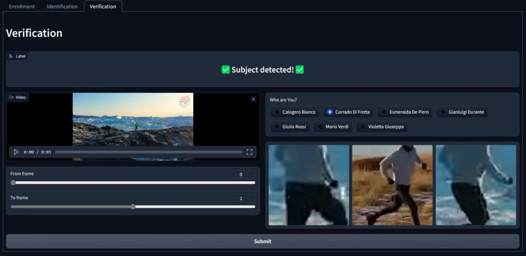

# Person Re-Identification

This project has the purpose to implement Person Re-Identification

## Features
1. Build a large custom dataset extracting frames from videos from all over the world.
1. Pre-train the model in an unsupervised manner on the dataset and then validate it on another one.
1. Train a supervised model with the pretrained weights.
1. An interactive demo interface that exploit the capabilities of the modela

<br>

# Run the code
### 1. Build a Custom dataset
To create a custom dataset you can execute the notebooks inside the following folder `/datasetBuilder`.
In this directory you can find three different program that represent the successive steps to:
> **GET -> EXTRACT -> CONVERT** <br>
> (url) &nbsp; &nbsp; &nbsp;&nbsp;(mp4 -> jpg)&nbsp; &nbsp; &nbsp;&nbsp; &nbsp;(mdb)

The first phase consists to get a video content using the rispective YouTube url.
```sh
run DownloadFormYT.ipynb
```
Subsequently it's necessary to extract from the `.mp4` result of previous code and convert into frame with format `.jpg`
```sh
run Extract.ipynb
```
The last one step consists into store all the collected frames in a LMDB Database (Lightning Memory-Mapped Database Manager)
```sh
run ConvertedLMDB.ipynb
```
<br>

### 2. Pre-train the model
Move into the `/fast-reid` folder
Example of train
```sh
python train.py --dataset_path "YOUR_LMDB_PATH\lmdb" --evaluation_path "YOUR_EVAL_DATASET_PATH\reid" --key_path "YOUR_LMDB_PATH\lmdb_1\keys.pkl" --gpu 0 --auto_resume True --epochs 100 --batch-size 64
```

<br>

### 3. Train a supervised model
Example of train
```sh
python tools/train_net.py --num-gpus 1 --config-file ./configs/MyDataset/r50_cuhk03.yml MODEL.BACKBONE.PRETRAIN_PATH "pre_models/pre-train/r50.pth" DATASETS.ROOT "datasets" INPUT.DO_AUTOAUG False TEST.EVAL_PERIOD 1 DATASETS.KWARGS "data_name:cuhk03+split_mode:id+split_ratio:1.0" OUTPUT_DIR "logs/r50/cuhk03/test" MODEL.DEVICE "cuda:0" TEST.PRECISE_BN.DATASET "cuhk03"
```
Example of evalutation of the trained model
```sh
python tools/train_net.py --eval-only --config-file ./configs/MyDataset/r50.yml DATASETS.ROOT "datasets" DATASETS.KWARGS "data_name:market" MODEL.WEIGHTS fast-reid/logs/r50/market/r50.pth MODEL.DEVICE "cuda:0" OUTPUT_DIR "logs//test/market"

```

<br>

### 4. Re-Identification Demo
✨Finally a graphic interface✨<br><br>
[](graphics/VerificationReadme.jpg)<br><br>
To use the demo you just have to run the following code, click on the generated url and enjoy: 
```sh
python interface.py
```
In the first window that you will see, you can decide wich process to testing:
 - **Enrollment**
 - **Verification**
 - **Identification**
 
To use the demo you don't need to modify nothing, but if you want to personalize the `Gallery` and `Query` paths (only for **Identification Task**) you can do it using the dedicated input text fields, otherwise you can use the default values.<br>
In the UI you can upload the interested video content (`.mp4`) and, according to the current interested task, specify some additional info if needed.<br>
The **Enrollment Task** requires a text value that represent the `Identity name`, used to store acquire frame in namesake folder.<br>
The **Verification Task** needs a claimed identity, selectable using the proposed `identity checkbox options` associated with identity photos.
